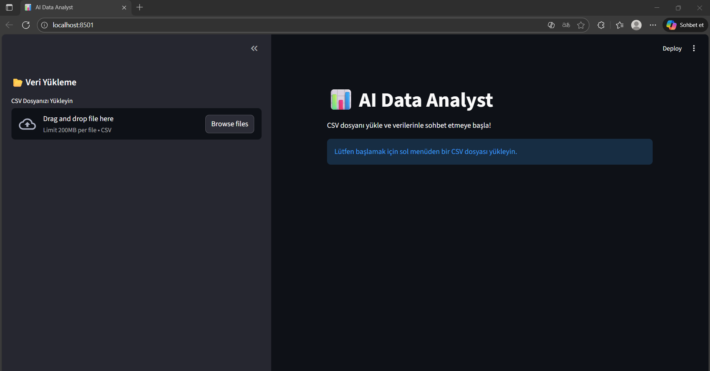

# 📊 AI Data Analyst (Text-to-SQL Agent)

Günümüz iş dünyasında veriye erişim kritik önem taşır, ancak SQL yazabilmek herkesin sahip olduğu bir yetenek değildir. AI Data Analyst, bu boşluğu doldurmak için geliştirilmiştir.

## 🚀 Proje Hakkında

Bu proje, yüklenen CSV verilerini otomatik olarak bir SQLite veritabanına dönüştürür ve Google Gemini 2.5 Flash modelini kullanarak kullanıcının sorduğu soruları SQL sorgularına çevirir. Sorguyu çalıştırır ve ham veriyi tekrar analiz ederek kullanıcıya içgörü dolu bir yanıt verir.

### Temel Özellikler

- **Doğal Dil İşleme**: "En çok satış yapan bölge neresi?" gibi soruları anlar.

- **Otomatik SQL Üretimi**: Karmaşık soruları (GROUP BY, ORDER BY, WHERE) saniyeler içinde SQL koduna çevirir.

- **Şeffaflık (Explainability)**: Üretilen SQL kodunu kullanıcıya göstererek güven sağlar.

- **Business Intelligence**: Sonuçları sadece tablo olarak değil, yönetici özeti şeklinde sözel olarak da yorumlar.

- **Hata Yönetimi**: CSV format hatalarını ve SQL syntax hatalarını yakalar.

## 💡 Kullanım

**1.** Sol menüden CSV dosyası yükleyin

**2.** Soru kutusuna doğal dilde soru yazın

- Ör: “En çok satış yapan kategori hangisi?”

**3.** “Analiz Et 🚀” butonuna basın

**4.** Uygulama otomatik olarak:

- SQL üretir

- Veriyi çeker

- Sonucu tablo şeklinde gösterir

- AI ile açıklama üretir

## 🛠 Kullanılan Teknolojiler

- **Frontend**: Streamlit (Hızlı veri uygulaması geliştirme)

- **LLM**: Google Gemini 2.5 Flash (Yüksek hız ve düşük maliyet)

- **Database**: SQLite (In-memory veritabanı yönetimi)

- **Data Manipulation**: Pandas (Veri okuma ve ön işleme)

## 📂 Proje Mimarisi

```text-to-sql-analyst/
│
├── app.py                  # Frontend (Streamlit) arayüzü
├── requirements.txt        # Gerekli kütüphaneler
├── .env                    # API Anahtarları (Gizli)
│
└──  src/                    
    ├── db_manager.py       # Veritabanı ve CSV işlemleri
    └── llm_manager.py      # Gemini API ve Prompt Mühendisliği

 
```

## ⚙️ Kurulum ve Çalıştırma

### 1. Gerekli Kütüphaneleri Yükleyin
```bash
pip install -r requirements.txt
```
### 2. API Anahtarını Ayarlayın
Ana dizinde .env adında bir dosya oluşturun ve Google Gemini API anahtarınızı ekleyin:
```
GOOGLE_API_KEY="Sizin_Keyiniz"
```
### 3. Uygulamayı Başlatın
```bash
streamlit run app.py
```
## 📸 Ekran Görüntüleri




**Örnek Senaryo:** Kullanıcının karmaşık bir kârlılık sorusu sorması ve sistemin anlık olarak SQL kodu üretip analiz etmesi.
1.  **Kullanıcı Girdisi:** Kullanıcı doğal dilde "Technology" kategorisindeki en kârlı ürünleri sorar.
2.  **SQL Üretimi:** Gemini 2.5 Flash modeli, bu soruyu `WHERE`, `GROUP BY` ve `ORDER BY` içeren optimize edilmiş bir SQL sorgusuna dönüştürür.
3.  **Sonuç:** Sorgu çalıştırılır, sonuç tablosu gösterilir ve yapay zeka verileri yorumlayarak yönetici özeti sunar.

### 🧠 Örnek Sorgular

- “Toplam sipariş sayısı nedir?”

- “2022’de en çok gelir elde eden şehir hangisi?”

